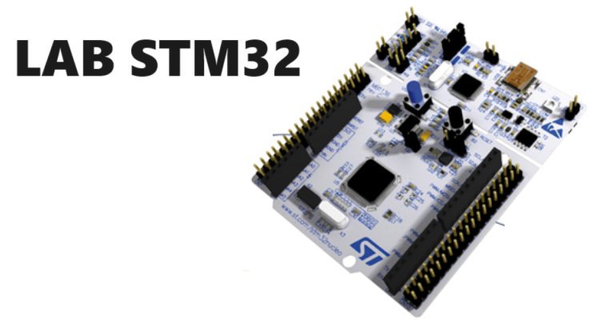

# LAB_F411_STM32CubeIDE
 
# Français : 

Description :
Ce répertoire GitHub contient une série d'exemples de code sous STM32CubeIDE et HAL destinée aux projets pratiques du cours sur le microcontrôleur STM32F411. Chaque fichier compressé correspond à un projet spécifique qui exploite des fonctionnalités particulières du microcontrôleur et vise à démontrer son utilisation dans divers scénarios.

Liste des fichiers :

F411_ADC.zip : Fournit un exemple de code illustrant l'utilisation du convertisseur analogique-numérique (CAN) du microcontrôleur STM32F411. Ce projet montre comment réaliser des mesures analogiques converties en données numériques.

F411_BLE.zip : Contient un exemple qui exploite la fonctionnalité Bluetooth Low Energy (BLE) du STM32F411. Il démontre la mise en œuvre de la communication sans fil à faible consommation d'énergie.

F411_I2C_LCD.zip : Présente un projet pratique pour contrôler un écran LCD via le protocole I2C. Il montre comment utiliser le microcontrôleur pour piloter un écran de cette manière.

F411_LED.zip : Un exemple simple de contrôle d'une LED à l'aide du microcontrôleur STM32F411. Il vise à illustrer les bases du contrôle des sorties GPIO pour allumer et éteindre une LED.

F411_LED_debug.zip : Propose un projet simple pour comprendre l'utilisation du débogage dans le contexte de l'allumage d'une LED. Il offre un exemple pratique pour les étudiants en ingénierie sur la façon d'utiliser le débogage pour vérifier le comportement de la LED.

F411_LM35.zip : Contient un exemple mettant en œuvre un capteur de température LM35 avec le microcontrôleur. Ce projet vise à mesurer et à interpréter les données de température provenant de ce capteur.

F411_PID.zip : Présente un exemple implémentant un contrôleur PID (Proportionnel, Intégral, Dérivé). Ce fichier vise à illustrer la régulation de systèmes dynamiques par un contrôleur PID.

F411_PID_APPLI_2.zip : Suite de l'application PID, partie plus avancée pour la mise en œuvre du contrôleur PID.

F411_PID_APPLI_3.zip : Continuation de l'application PID, troisième partie du projet pour le contrôleur PID.

F411_PWM.zip : Contient un exemple de code démontrant la modulation de largeur d'impulsion (PWM). Le projet illustre comment générer des signaux PWM à l'aide du microcontrôleur STM32F411.

F411_PWM2.zip : Suite de l'exemple précédent pour la modulation de largeur d'impulsion. Propose des fonctionnalités avancées ou des applications supplémentaires concernant le PWM.

F411_Push_Button.zip : Un projet pratique pour manipuler un bouton poussoir à l'aide du microcontrôleur STM32F411. L'exemple montre comment réagir à l'état du bouton pour contrôler une LED, par exemple.

F411_Push_Button_IT.zip : Variation du projet précédent, mais cette fois, la détection d'appui sur le bouton est effectuée via des interruptions matérielles (External Interrupt).

F411_RTC.zip : Contient un exemple illustrant la configuration et l'utilisation de l'horloge temps réel (RTC) du microcontrôleur STM32F411. Montre comment configurer et exploiter les fonctionnalités de l'horloge RTC.

F411_Rotary_Encoder.zip : Présente un projet mettant en œuvre un encodeur rotatif avec le microcontrôleur STM32F411. Il détaille comment interpréter les signaux de l'encodeur rotatif pour différentes applications.

F411_SPI_7735_Screen.zip : Contient un exemple montrant l'utilisation d'un écran 7735 via le protocole de communication SPI. Le projet met en évidence la configuration et le contrôle de l'écran 7735 à l'aide du microcontrôleur.

F411_SampleApp_BLE.zip : Propose un exemple d'application utilisant la connectivité Bluetooth Low Energy (BLE) du microcontrôleur STM32F411. Il offre un exemple d'application BLE simple et détaillée pour l'ingénierie logicielle.

F411_Sensor_Demo_BLE.zip : Suite de l'exemple précédent, fournissant une démonstration d'application liée à un capteur via la communication BLE.

F411_TC74.zip : Contient un exemple mettant en œuvre le capteur de température TC74 avec le microcontrôleur. Montre comment collecter et traiter les données de température via ce capteur spécifique.

F411_Timer.zip : Démontre l'utilisation des fonctionnalités de minuterie du microcontrôleur. Il explique comment configurer et exploiter les minuteries internes pour différentes applications.

F411_UART.zip : Contient un exemple pour établir une communication UART (Universal Asynchronous Receiver Transmitter) avec le microcontrôleur STM32F411. Cet exemple couvre l'envoi et la réception de données via l'UART.

F411_UART_BLE.zip : Extension de l'exemple précédent, mais cette fois, en intégrant la communication UART avec Bluetooth Low Energy.

F411_UART_HMI.zip : Propose un exemple d'interaction avec une interface homme-machine (HMI) via la communication UART.

F411_UART_IT.zip : Contient un exemple montrant la gestion des interruptions pour la communication UART du microcontrôleur.

F411_UART_Update_BLE.zip : Exemple mettant en œuvre la mise à jour du micrologiciel (firmware) via la communication UART et Bluetooth Low Energy.

F411_UART_read.zip : Propose un exemple illustrant la lecture de données via la communication UART.

F411_UART_write.zip : Détaille un exemple décrivant l'écriture et l'envoi de données via la communication UART.

Chacun de ces répertoires contient des exemples de code, des projets STM32 CubeIDE, des configurations matérielles et logicielles spécifiques à chaque projet. Ces ressources sont conçues pour aider les étudiants à apprendre et à explorer les diverses fonctionnalités du microcontrôleur STM32F411 dans le cadre de leur formation.

# English: 

Description:
This GitHub directory contains a series of code examples in STM32CubeIDE and HAL for practical projects in the STM32F411 microcontroller course. Each compressed file corresponds to a specific project that exploits particular functionalities of the microcontroller and aims to demonstrate its use in various scenarios.

List of files :

F411_ADC.zip: Provides sample code illustrating the use of the STM32F411 microcontroller's analogue-to-digital converter (ADC). This project shows how to carry out analogue measurements converted into digital data.

F411_BLE.zip: Contains an example that exploits the Bluetooth Low Energy (BLE) functionality of the STM32F411. It demonstrates the implementation of low energy wireless communication.

F411_I2C_LCD.zip: Presents a practical project for controlling an LCD display via the I2C protocol. It shows how to use the microcontroller to drive a display in this way.

F411_LED.zip : A simple example of controlling an LED using the STM32F411 microcontroller. It aims to illustrate the basics of controlling GPIO outputs to turn an LED on and off.

F411_LED_debug.zip : Provides a simple project to understand the use of debugging in the context of turning on an LED. It provides a practical example for engineering students of how to use debugging to check LED behaviour.

F411_LM35.zip : Contains an example implementing an LM35 temperature sensor with the microcontroller. The aim of this project is to measure and interpret temperature data from this sensor.

F411_PID.zip: Contains an example implementing a PID (Proportional, Integral, Derivative) controller. The purpose of this file is to illustrate the regulation of dynamic systems using a PID controller.

F411_PID_APPLI_2.zip : Continuation of the PID application, more advanced part for the implementation of the PID controller.

F411_PID_APPLI_3.zip : Continuation of the PID application, third part of the project for the PID controller.

F411_PWM.zip : Contains sample code demonstrating pulse width modulation (PWM). The project illustrates how to generate PWM signals using the STM32F411 microcontroller.

F411_PWM2.zip: Continuation of the previous example for pulse width modulation. Offers advanced functionalities or additional applications concerning PWM.

F411_Push_Button.zip : A practical project for manipulating a push button using the STM32F411 microcontroller. The example shows how to react to the state of the button to control an LED, for example.

F411_Push_Button_IT.zip: Variation on the previous project, but this time the button is detected using hardware interrupts (External Interrupt).

F411_Push_Button_IT.zip : Variation on the previous project, but this time the button press detection is carried out via hardware interrupts (External Interrupt).

F411_RTC.zip: Contains an example illustrating the configuration and use of the STM32F411 microcontroller's real-time clock (RTC). It shows how to configure and use the RTC functions.

F411_Rotary_Encoder.zip: Presents a project implementing a rotary encoder with the STM32F411 microcontroller. It details how to interpret the rotary encoder signals for different applications.

F411_SPI_7735_Screen.zip : Contains an example showing the use of a 7735 screen via the SPI communication protocol. The project highlights the configuration and control of the 7735 screen using the microcontroller.

F411_SampleApp_BLE.zip: Provides an example of an application using the Bluetooth Low Energy (BLE) connectivity of the STM32F411 microcontroller. It provides a simple and detailed BLE application example for software engineering.

F411_Sensor_Demo_BLE.zip : Continuation of the previous example, providing a demonstration of an application linked to a sensor via BLE communication.

F411_TC74.zip: Contains an example implementing the TC74 temperature sensor with the microcontroller. It shows how to collect and process temperature data via this specific sensor.

F411_Timer.zip: Demonstrates the use of the microcontroller's timer functions. It explains how to configure and use the internal timers for different applications.

F411_UART.zip : Contains an example of how to establish a UART (Universal Asynchronous Receiver Transmitter) communication with the STM32F411 microcontroller. This example covers the sending and receiving of data via the UART.

F411_UART_BLE.zip: Extension of the previous example, but this time integrating UART communication with Bluetooth Low Energy.

F411_UART_HMI.zip: Provides an example of interaction with a human-machine interface (HMI) via UART communication.

F411_UART_IT.zip : Contains an example showing interrupt management for the microcontroller's UART communication.

F411_UART_Update_BLE.zip: Example implementing firmware update via UART and Bluetooth Low Energy communication.

F411_UART_read.zip: Provides an example of reading data via UART communication.

F411_UART_write.zip: Details an example describing the writing and sending of data via UART communication.

Each of these directories contains code examples, STM32 CubeIDE projects, hardware and software configurations specific to each project. These resources are designed to help students learn and explore the various functionalities of the STM32F411 microcontroller as part of their training.
